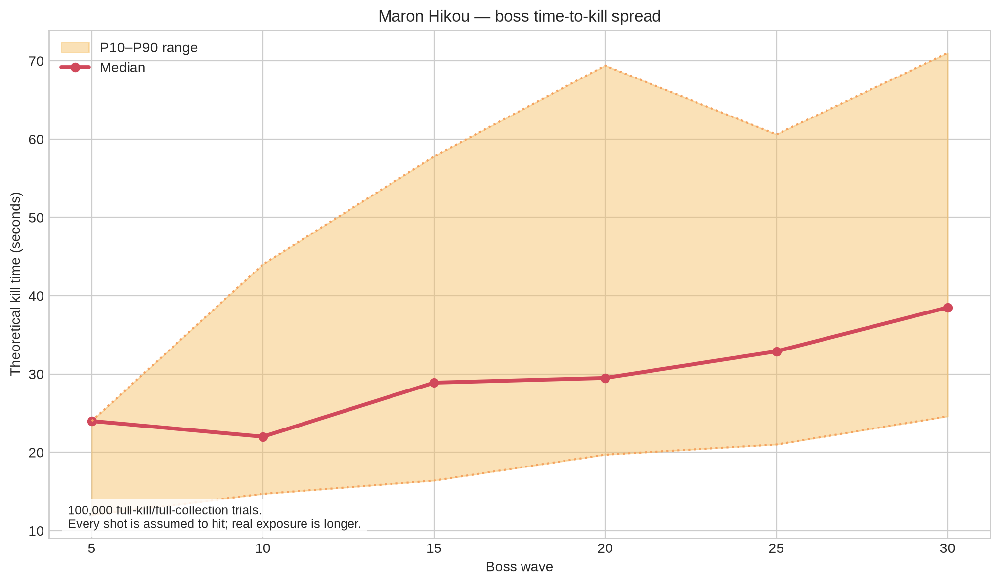

# 02. 敵対的バランス監査

## 1. 監査結論

マロン飛行の中核ループは有望である。プレイヤーは自動射撃によって「照準」ではなく、**回避・位置取り・戦利品回収の判断**へ注意を使える。ホーム画面も「敵を倒す」「戦利品で強化」「30波突破」を簡潔に提示しており、名前入力、カウントダウン、HUD、結果画面の基本導線は成立している。

しかし、ランキングを伴うゲームとして見ると、現状の結果はプレイスキルだけでは決まらない。完全ランダムの強化、非決定的な敵・ドロップ、フレーム依存追従、クライアントが組み立てる送信スコアにより、**同程度の技量でも端末・乱数・改ざん可否で順位が分岐する**。以下の問題は、追加コンテンツではなく公開前の基礎品質として扱う。

## 2. 監査方法と読み方

| 項目 | 実施内容 | この結果が意味すること |
|---|---|---|
| 実ブラウザ確認 | ホーム、名前入力、カウントダウン、初期W1、HUD、回収半径の表示を確認。 | 初期導線と視認性の基礎は成立。 |
| 静的解析 | `index.html`の定数、生成、衝突、回収、成長、ランキングを読解。 | 全ての数値上の指摘は実装値に基づく。 |
| 成長分布 | 100,000試行。全敵撃破・全戦利品回収という**有利な仮定**で、ドロップと強化抽選を再現。 | 実プレイは被弾・取り逃しを含むため、下振れはこれより悪い。 |
| TTK算出 | 各ボス直前のビルドから、全弾命中を仮定した理論撃破時間を計算。 | 低火力ビルドは実戦でさらに長くなる。 |

再実行用のスクリプトと生データは、[scripts/audit-growth-distribution.mjs](scripts/audit-growth-distribution.mjs) および [data/audit-growth-distribution.json](data/audit-growth-distribution.json) にある。

## 3. 優先度付きの問題一覧

| 優先度 | 問題 | 悪用・不満の経路 | 影響 | 先に直す理由 |
|---|---|---|---|---|
| **Critical** | 強化が完全ランダムで、攻撃力の下振れを防げない。 | W5前に攻撃強化を引けず、長時間ボス弾幕に晒される。 | 技量より引きで到達波が決まる。 | プレイ体験と競技公平性の両方を壊す。 |
| **Critical** | 敵、ドロップ、強化がすべて非決定的。 | 同じ条件でも異なる敵配置・報酬・ビルドになる。 | 日次や総合ランキングの比較が不公平。 | 固定seed競技を導入しない限り、順位の意味が弱い。 |
| **High** | 追従係数がフレーム固定。 | 低FPS端末では同じ指の動きでも機体が遅れる。 | 端末性能が難易度になる。 | モバイル競技の公平性に直結。 |
| **High** | 敵を画面下へ逃がしてもペナルティがない。 | 危険な敵を倒さず通過待ちし、敵が消えたら波を進められる。 | 「倒して拾う」が最適でなくなる。 | 中核ループの意義が薄れる。 |
| **High** | 敵密度を2倍にし、ドロップ率を半減している。 | 成長量は据え置きなのに、回避・処理負荷だけ増える。 | リスク/報酬比が悪化。 | 調整意図と体感が乖離する。 |
| **Medium** | 敵弾上限160を超えると古い弾を削除する。 | 最も危険な場面で既発射弾が消える。 | 難度が不連続で再現しない。 | 高密度の後半・ボス戦で顕在化。 |
| **Medium** | クライアントが合成スコアを送信する。 | 開発者ツール等で任意の`p_score`を送信できる可能性。 | ランキングの信頼を失う。 | RPC側検証を確認するまで競技公開できない。 |

## 4. 最重要問題: 成長RNGの下振れ

### 4.1 実装上の原因

レベルアップ時、未上限の7種の強化候補から1種を等確率で即時付与している。プレイヤーは選べず、リロールもできない。攻撃系は弾数、連射、貫通の3種、防御・回避・回収系は4種である。初期の経験値量ではレベルアップ回数自体が少ないため、攻撃を得られないままW5へ到達し得る。

| 強化 | 上限 | 性質 | 早期に引けない場合の影響 |
|---|---:|---|---|
| 弾数+1 | 3 | 直接DPSと横カバーを増加。 | ボス・中型敵の処理が遅い。 |
| 連射速度 | 4 | 発射間隔を0.85倍。 | 長期戦ほど不利。 |
| 貫通弾 | 1 | 群れの効率を上げる。 | 雑魚密度の上昇に追いつきにくい。 |
| シールド | 3 | 1被弾を無効化。 | 生存寄りだが撃破速度を補わない。 |
| 最大耐久 | 3 | 最大耐久と現在耐久を増加。 | 生存寄りだが撃破速度を補わない。 |
| 回収範囲 | 3 | 取りに行く危険を下げる。 | 成長には良いが直接火力ではない。 |
| 当たり判定縮小 | 2 | 回避を強化。 | 上手いプレイヤーほど価値があるが火力ではない。 |

### 4.2 100,000試行の結果

| ボス波 | 直前Lv P10 / P50 / P90 | 理論DPS P10 / P50 / P90 | 全弾命中TTK P10 / P50 / P90 | 攻撃強化ゼロ率 |
|---:|---:|---:|---:|---:|
| W5 | 2 / 2 / 3 | 2.50 / 2.50 / 5.00 | 12.0 / 24.0 / 24.0秒 | **49.141%** |
| W10 | 5 / 6 / 6 | 2.50 / 5.00 / 7.50 | 14.7 / 22.0 / 44.0秒 | 6.204% |
| W15 | 8 / 9 / 9 | 2.94 / 5.88 / 10.38 | 16.4 / 28.9 / 57.8秒 | 1.077% |
| W20 | 10 / 11 / 11 | 3.46 / 8.14 / 12.21 | 19.7 / 29.5 / 69.4秒 | 0.119% |
| W25 | 12 / 12 / 12 | 4.79 / 8.82 / 13.84 | 21.0 / 32.9 / 60.6秒 | 0.018% |
| W30 | 12 / 12 / 12 | 4.79 / 8.82 / 13.84 | **24.6 / 38.5 / 71.0秒** | 0.018% |

> P10は速い撃破側、P90は遅い撃破側である。しかも上表のTTKは「全弾が命中する」という楽観条件であり、実際には回避・位置取り・戦利品回収でさらに差が拡大する。



### 4.3 直すべき設計方針

ランダム性を消す必要はない。**最低火力の保証と、余剰ビルドのランダム性を分ける**べきである。最小修正は、初回レベルアップで攻撃系を必ず1つ付与する方法である。より良い方法は、攻撃・防御・回収/回避から各1候補を提示し、プレイヤーに1つだけ選ばせる方法である。後者は操作を増やすが、レベルアップ時のみなので、縦シューの基本操作を壊さず、プレイヤーに負けの理由と対策を与えられる。

受け入れ基準は、少なくとも **W5直前の攻撃強化ゼロ率0%** とする。次に、全弾命中前提のW30 TTKについて、P10〜P90の幅を20秒以内に収める。なお、これは完成条件ではなく、実機プレイテストを始められる下限である。

## 5. リスク/報酬と「逃走」の問題

戦利品は敵撃破後に落ち、近づくと吸引される。これは良い。しかし、敵本体は画面下を通過すると配列から削除され、減点も、次波への持越しも、明示的な報酬喪失もない。波のクリア判定も「出現キューが空で、画面上に敵がいない」ことである。そのため、危険な大型敵・弾幕敵を処理できないと判断した場合、**倒さずに回避して画面下へ逃がす**戦略が成立する。

これは必ずしも不正ではない。正式に「生存優先で敵をやり過ごす」ゲームへ寄せるなら、到達波を主とする現ランキングと整合する。ただし仕様は「敵を倒し、戦利品を拾い、育つ」を中核にしている。設計意図を守るなら、次のいずれかを明文化・実装する。

| 方針 | 実装例 | 利点 | 注意点 |
|---|---|---|---|
| 撃破重視 | 逃走敵の数を結果へ表示し、スコア・経験値・次波ボーナスを減らす。 | 倒す価値が明確。 | 初心者への罰が強すぎないようにする。 |
| 圧力持越し | 逃走敵を次波にも残す、または同等の危険を追加する。 | 放置が一時しのぎになる。 | 後半雪だるま化を厳しく管理する。 |
| 生存重視 | 逃走を正式戦略とし、撃破はスコア・成長のためのリスク行為に再定義する。 | 現実装に近い。 | 到達波ランキングだけでは評価が粗い。 |

## 6. 端末差とフレーム依存

現追従はフレームごとに次式で位置を更新する。

```text
player.x += (targetX - player.x) × 0.35
player.y += (targetY - player.y) × 0.35
```

この実装では、目標まで90%近づくのに約5.35フレームを要する。従って30fpsで約178ms、60fpsで約89ms、120fpsで約45msとなり、フレームレートが低い端末ほど操作遅延が大きくなる。モバイルゲームでの難易度差としては許容できない。

推奨式は、速度定数`lambda`と経過時間`delta`を使う指数補間である。

```js
const followLambda = 25;
const alpha = 1 - Math.exp(-followLambda * delta);
player.x += (player.targetX - player.x) * alpha;
player.y += (player.targetY - player.y) * alpha;
```

このようにすれば、同じ実時間なら30/60/120fpsでほぼ同じ追従感になる。実装後は30fps、60fps、120fps相当で90%追従時間が±10%以内に収まることを自動計測する。

## 7. 競技ランキングの問題

現状では、敵の出現位置、移動位相、ドロップ、強化選択に`Math.random()`を使う。さらに、クライアントが`ranking_score`を作り、公開可能キーを使ってRPCへ送る。クライアント側の`scoreSent`は二重送信のUX対策としては正しいが、改ざんへの対策ではない。

### 推奨する分離

| モード | 乱数 | ランキング | 目的 |
|---|---|---|---|
| 通常飛行 | ランダム | カジュアル記録のみ、または別ランキング。 | 毎回違うビルドを楽しむ。 |
| 本日の飛行 | 日付・バージョンから固定seed。 | 正式ランキング。 | 同条件で腕前を比較する。 |
| 練習 | 固定シナリオまたは任意seed。 | 送信しない。 | パターン学習と端末確認。 |

サーバー側では、少なくともゲームslug、表示名長、スコア範囲、進行度範囲、レート制限を検証する。理想は、固定seed・クライアントバージョン・プレイ時間・入力またはイベント要約を送信し、サーバーが異常値を弾く構造である。完全なリプレイ検証をすぐ導入できない場合でも、クライアントの任意整数をそのまま最上位記録へ採用してはならない。

## 8. 変更してはいけない対症療法

| やってはいけないこと | 理由 |
|---|---|
| W5だけボスHPを下げて終了する。 | 根本は攻撃下振れと成長の選択不能であり、後半に問題が移る。 |
| 敵密度だけ下げる。 | 回避圧は下がるが、戦利品回収の面白さ・DPS格差・端末差は残る。 |
| 敵弾上限をさらに下げる。 | 弾が消える不連続さを増やすだけ。発生制御を行う。 |
| ランキングを非公開にして問題を隠す。 | カジュアルモードは成立しても、再公開時に同じ問題が再発する。 |
| 実機未確認のまま「60fpsで動く」と宣言する。 | 追従、canvas、HUD、入力抑止はiOS Safariで最終確認が必要。 |

## 参照

- [仕様 v0.2](../SPEC_v0.2.md)
- [既知の問題・実機確認項目](../known-issues.md)
- [監査生データ](data/audit-growth-distribution.json)
- [再現スクリプト](scripts/audit-growth-distribution.mjs)
